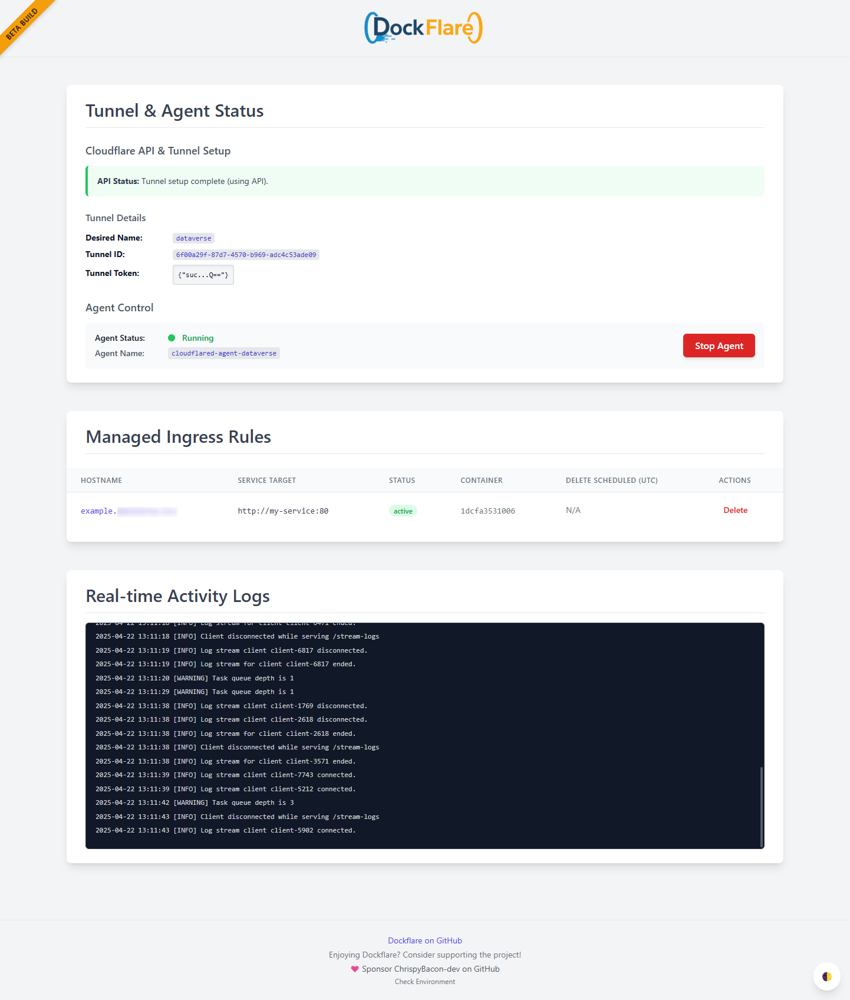
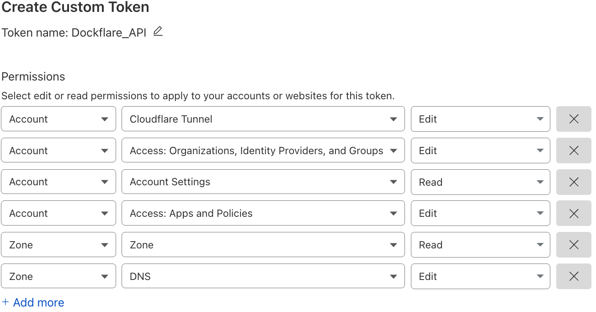

[](https://github.com/ChrispyBacon-dev/DockFlare)
[]()
[](https://en.wikipedia.org/wiki/Central_processing_unit)
[](https://github.com/ChrispyBacon-dev/DockFlare/releases/tag/v2.0.0)
[](https://hub.docker.com/r/alplat/dockflare)
[](https://www.python.org/)
[](https://github.com/ChrispyBacon-dev/dockflare/issues)
[](https://github.com/ChrispyBacon-dev/dockflare/commits/stable)
[](https://github.com/ChrispyBacon-dev/dockflare/commits/stable)


---

### ✨ Visit the new official project website at [dockflare.app](https://dockflare.app) ✨

---

## 🚀 What is DockFlare?

DockFlare simplifies your Cloudflare Tunnel and Zero Trust management. It began as a tool to automate ingress configuration from Docker labels, but has evolved into much more. With a powerful web UI, you can now centrally manage reusable access policies (**Access Groups**), define rules for non-Dockerized services, and override any configuration on the fly. It's a self-hosted ingress controller designed to make securing your applications hassle-free, persistent, and centralized.

<details>
<summary>✨ Key Features in v2.0</summary>

-   **Centralized Access Policy Management via UI (Access Groups)**:
    -   **NEW in v2.0:** Create reusable Access Groups (e.g., "family", "dev-team") with specific rules in the UI.
    -   Apply a complete, complex policy to any container with a single, simple label: `dockflare.access.group=family`.
    -   Update a group in the UI, and the changes are automatically applied to all services using it.
-   **Dynamic Ingress via Docker Labels**:
    -   Auto-configures Tunnel ingress & DNS from Docker labels (`dockflare.*` prefix, backward compatible with `cloudflare.tunnel.*`).
    -   Supports various service types (`http`, `https`, `tcp`, `ssh`, `rdp`, `http_status`).
    -   Controls `no_tls_verify`, `originServerName` (SNI), and `httpHostHeader` for origin connections.
-   **Flexible Routing**:
    -   Route multiple URL paths on the same hostname to different services.
    -   Supports multiple hostnames (with unique targets, zones, or policies) per container using indexed labels.
-   **Manual Ingress Rule Management**:
    -   Add & manage public hostnames for non-Docker services (e.g., a router or NAS) directly from the Web UI.
-   **Comprehensive Web UI**:
    -   **NEW in v2.0:** A focused **Dashboard** for viewing managed rules and real-time logs.
    -   **NEW in v2.0:** A dedicated **Settings** page for managing Access Groups, viewing all account tunnels, and controlling the agent.
    -   Override policies for any rule; UI changes persist over container labels, with an option to revert.
-   **State Persistence & Graceful Deletion**:
    -   A configurable grace period prevents services from disappearing immediately after a container stops.
    -   Persists all rules, Access App IDs, and UI overrides in a `state.json` file.
-   **Intelligent Reconciliation**:
    -   Continuously syncs the desired state from Docker, manual entries, and groups with your live Cloudflare configuration (Tunnel, DNS, Access Apps).

[Learn more on the GitHub Wiki](https://github.com/ChrispyBacon-dev/DockFlare/wiki)

</details>

---

## 🖼️ Web UI Preview (v2.0)



---

## ⚙️ Getting Started

<details>
<summary>📋 Important Prerequisites for Cloudflare API</summary>

- Docker: [Install Docker](https://docs.docker.com/engine/install/)
- Docker Compose: [Install Docker Compose](https://docs.docker.com/compose/install/)
- Cloudflare Account with:
  - API Token with the following permissions: Account:Cloudflare Tunnel:Edit, Account:Account Settings:Read, Account:Access: Apps and Policies:Edit, Zone:Zone:Read, Zone:DNS:Edit
  
  - Account ID (found in Cloudflare Dashboard → Overview)
  - Zone ID (found in Cloudflare Dashboard → Overview for your primary domain)

</details>

### 🚀 Quick Start (Docker Compose)

1.  **Create `docker-compose.yml`**:
    ```yaml
    version: '3.8'
    services:
      dockflare:
        image: alplat/dockflare:stable # Or :unstable for the latest features
        container_name: dockflare
        restart: unless-stopped
        ports:
          - "5000:5000"
        env_file:
          - .env
        volumes:
          - /var/run/docker.sock:/var/run/docker.sock:ro
          - ./dockflare_data:/app/data
        networks:
          - cloudflare-net

    volumes:
      dockflare_data:

    networks:
      cloudflare-net:
       name: cloudflare-net
       external: true # Assumes you have a network named 'cloudflare-net'
    ```

2.  **Create `.env` File**:
    Copy `env.example` to `.env` and fill in your details.
    <details>
    <summary>📄 Example `.env` content (Click to expand)</summary>

    ```dotenv
    # === REQUIRED CLOUDFLARE CREDENTIALS ===
    CF_API_TOKEN=your_cloudflare_api_token_here
    CF_ACCOUNT_ID=your_cloudflare_account_id_here
    CF_ZONE_ID=your_default_cloudflare_zone_id_here
    
    # === TUNNEL CONFIGURATION ===
    TUNNEL_NAME=DockFlare-Tunnel
      
    # === DOCKFLARE BEHAVIOR & CUSTOMIZATION ===
    GRACE_PERIOD_SECONDS=28800
    # ... and other variables
    ```
    *Refer to `env.example` for a full list of options and detailed comments.*
    </details>

3.  **Run DockFlare**:
    ```bash
    docker compose up -d
    ```

4.  **Access the Web UI**: Open `http://your-server-ip:5000` in your browser.

---

## 🏷️ How It Works & Labeling Containers

DockFlare's power comes from its flexible, layered approach to configuration.

- **Access Groups First (Recommended)**: The easiest and most maintainable way to secure services is to create an **Access Group** in the UI and apply it with a single label.
- **Individual Labels for One-Offs**: For services that don't fit a group, you can still use individual `dockflare.access.*` labels for initial configuration.
- **UI for Dynamic Overrides**: The Web UI can override the access policy for any service, whether it was configured by a group or by individual labels. UI changes are persistent.

<details>
<summary>📝 Labeling Your Containers (v2.0 Examples)</summary>

> **Note:** The recommended label prefix is `dockflare.`. The old `cloudflare.tunnel.` prefix is still supported for backward compatibility.

#### 1. Recommended Method: Using an Access Group

Assuming you created an Access Group with the ID `nas-family` in the UI:

```yaml
services:
  picoshare:
    image: mtlynch/picoshare
    labels:
      - "dockflare.enable=true" 
      - "dockflare.hostname=files.example.com"
      - "dockflare.service=http://picoshare:8080" 
      
      # Apply the entire policy with one label:
      - "dockflare.access.group=nas-family"
```

#### 2. Alternative Method: Using Individual Labels

For a service with a unique, one-off policy:

```yaml
services:
  my-service:
    image: nginx:latest
    labels:
      - "dockflare.enable=true" 
      - "dockflare.hostname=my-service.example.com"
      - "dockflare.service=http://my-service:80" 
      
      # Optional individual labels for a one-off policy
      - "dockflare.access.policy=authenticate"
      - "dockflare.access.allowed_idps=YOUR_IDP_UUID_HERE"
```

</details>

<details>
<summary>🛡️ All Access Policy Labels (for one-off configs)</summary>

Use these labels only when **not** using `dockflare.access.group`.

| Label                               | Description                                                                                                                                                                                             | Default                | Example                                                                                   |
| :---------------------------------- | :------------------------------------------------------------------------------------------------------------------------------------------------------------------------------------------------------ | :--------------------- | :---------------------------------------------------------------------------------------- |
| `dockflare.access.policy`           | Type: `bypass` (public app), `authenticate` (IdP login), `default_tld` (inherits from `*.domain.com` policy). If unset, service is public (no Access App).                                              | (None/Public)          | `dockflare.access.policy="authenticate"`                                        |
| `dockflare.access.name`             | Custom name for the Cloudflare Access Application.                                                                                                                                                      | `DockFlare-{hostname}` | `dockflare.access.name="My Web App Access"`                                      |
| `dockflare.access.session_duration` | Session duration (e.g., `24h`, `30m`).                                                                                                                                                                | `24h`                  | `dockflare.access.session_duration="1h"`                                         |
| `dockflare.access.custom_rules`     | JSON string array of [Cloudflare Access Policy rules](https://developers.cloudflare.com/api/operations/access-policies-create-an-access-policy). Overrides basic `access.policy` decisions.         | (None)                 | `'...=[{"email":{"email":"user@example.com"},"action":"allow"},{"action":"block"}]'` |
| ...                                 | *Other `access.*` labels for launcher visibility, IdPs, etc. are also available.*                                                                                                                         |                        |                                                                                           |


</details>

---

## ✨ Prometheus Metrics & Observability
(This section remains unchanged, you can keep your existing content here)

---

## 🔧 Advanced Configuration & Usage
(This section remains unchanged, you can keep your existing content here)

---
## ✨ Star History

[](https://www.star-history.com/#ChrispyBacon-dev/DockFlare&Date)

## 🤝 Contributing

Contributions are welcome! Please see [CONTRIBUTING.md](CONTRIBUTING.md) or open an issue/PR.

## 📜 License

DockFlare is licensed under the GNU General Public License v3.0. See [LICENSE.MD](LICENSE.MD) for details.
```